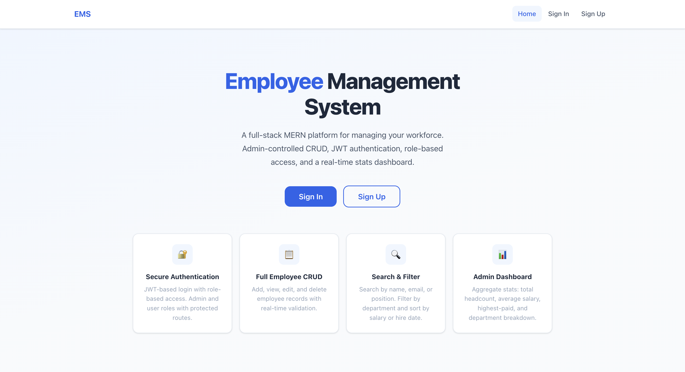
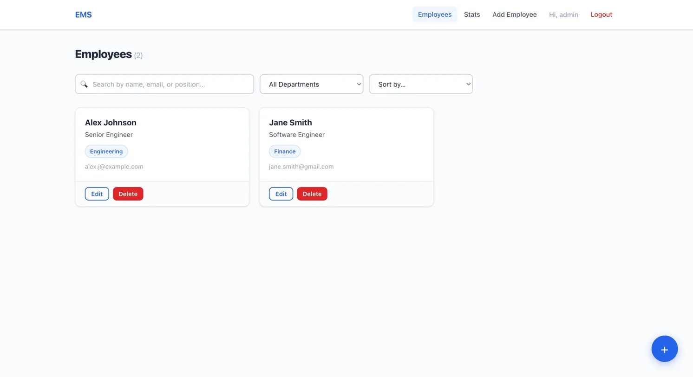
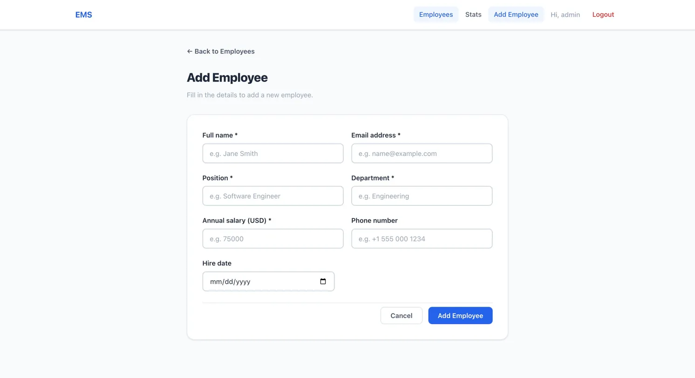
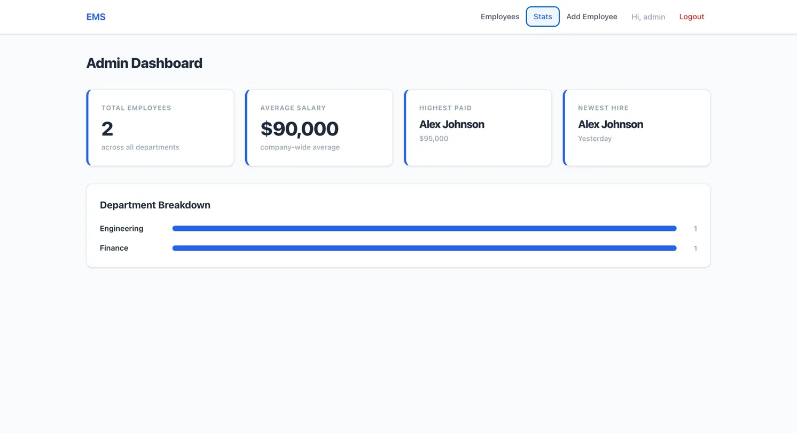
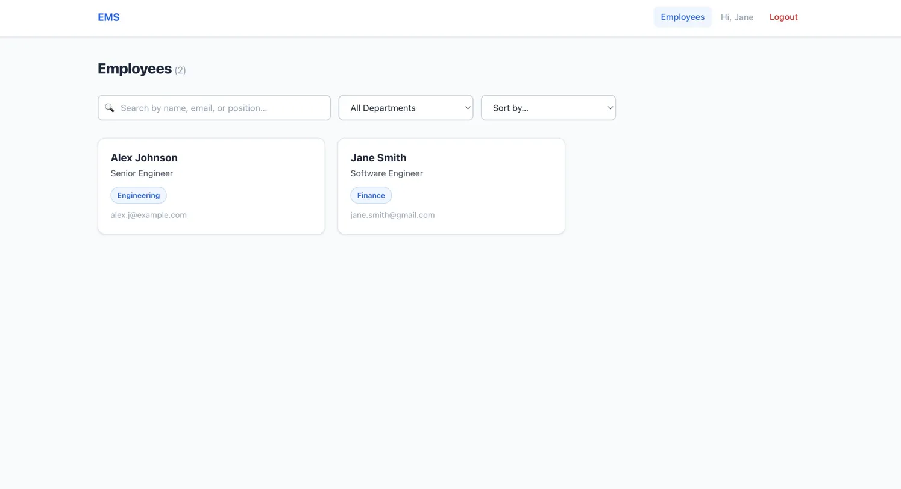

# Employee Management System — PRODIGY\_FS\_02

Built for the Prodigy InfoTech Full Stack Developer Internship, Task 02.

---

## Overview

A full-stack MERN employee management platform that gives organizations a clean, role-based interface for managing their workforce. Authenticated admins can create, update, and delete employee records; any logged-in user can browse, search, filter, and sort the directory. A dedicated stats dashboard aggregates headcount, salary data, and department breakdowns in real time.

---

## Screenshots

### Landing Page


### Employee List — Admin View


### Add Employee Form


### Admin Stats Dashboard


### Employee List — Regular User View


<!--


-->

---

## Features

### Authentication & Security

- JWT-based stateless authentication with 30-day token expiry
- Passwords hashed with bcrypt (salt rounds: 10)
- `select: false` on password field — never returned in queries
- Role-based access control: `user` (read-only) and `admin` (full CRUD)
- Rate limiting on auth endpoints: 20 requests per 15 minutes per IP

### Employee Management

- Full CRUD: create, read, update, delete employee records
- Fields: name, email, position, department, salary, phone, hire date
- Server-side search across name, email, and position fields
- Department filter and multi-field sort (name, salary, hire date) via query params
- Email uniqueness enforced at both model and controller layers
- Client-side form validation with inline error messages

### Admin Dashboard

- Live stats endpoint: total employees, average salary, highest-paid employee, newest hire
- Department breakdown with proportional bar chart
- All admin routes protected by both `protect` and `admin` middleware

### UX

- Fully responsive layout (flexbox + CSS grid, mobile-first breakpoints)
- Toast notifications (react-toastify) for every success and error
- Loading spinners during async operations
- Buttons show loading state ("Saving…", "Deleting…") while requests are in flight
- Confirmation modal before destructive deletes
- Debounced search input (350 ms) to avoid excessive API calls

---

## Tech Stack

| Layer     | Technology                                                  |
|-----------|-------------------------------------------------------------|
| Frontend  | React 18, React Router v6, Context API, Axios, React Toastify |
| Backend   | Node.js, Express 4                                          |
| Database  | MongoDB Atlas via Mongoose 8                                |
| Auth      | jsonwebtoken, bcryptjs                                      |
| Rate Limiting | express-rate-limit                                      |
| Dev Tools | nodemon, Create React App                                   |

---

## Project Structure

```
PRODIGY_FS_02/
├── employee-crud-app/          # Express API
│   ├── config/
│   │   └── db.js               # Mongoose connection
│   ├── controllers/
│   │   ├── authController.js   # register, login, getMe
│   │   └── employeeController.js
│   ├── middleware/
│   │   └── auth.js             # protect + admin middleware
│   ├── models/
│   │   ├── User.js
│   │   └── Employee.js
│   ├── routes/
│   │   ├── authRoutes.js
│   │   └── employeeRoutes.js
│   ├── scripts/
│   │   └── seedAdmin.js        # One-time admin seeder
│   ├── .env.example
│   ├── .gitignore
│   ├── package.json
│   └── server.js
│
└── employee-crud-frontend/     # React SPA
    ├── public/
    │   └── index.html
    ├── src/
    │   ├── components/
    │   │   ├── Navbar.js
    │   │   ├── PrivateRoute.js
    │   │   ├── EmployeeCard.js
    │   │   ├── Modal.js
    │   │   └── ConfirmDeleteModal.js
    │   ├── context/
    │   │   └── AuthContext.js
    │   ├── pages/
    │   │   ├── Home.js
    │   │   ├── Login.js
    │   │   ├── Register.js
    │   │   ├── EmployeeList.js
    │   │   ├── EmployeeDetails.js
    │   │   ├── EmployeeForm.js
    │   │   └── AdminStats.js
    │   ├── utils/
    │   │   └── api.js           # Axios instance with interceptors
    │   ├── App.js
    │   ├── index.js
    │   └── index.css
    ├── .gitignore
    └── package.json
```

---

## Getting Started

### Prerequisites

- Node.js 18+
- A MongoDB Atlas cluster (or local MongoDB instance)

### 1. Clone the repository

```bash
git clone https://github.com/akallam3/PRODIGY_FS_02.git
cd PRODIGY_FS_02
```

### 2. Configure the backend

```bash
cd employee-crud-app
cp .env.example .env
# Edit .env and fill in your MONGO_URI and JWT_SECRET
```

### 3. Install backend dependencies

```bash
npm install
```

### 4. Seed the default admin user

```bash
npm run seed
```

This creates an admin account using `SEED_ADMIN_EMAIL` and `SEED_ADMIN_PASSWORD` from your `.env` file (defaults: `admin@example.com` / `Admin@1234`). It will not overwrite an existing admin. **Change these credentials after your first login.**

### 5. Start the backend

```bash
npm run dev          # development (nodemon, hot reload)
# or
npm start            # production
```

The API will be available at `http://localhost:5051`.

### 6. Install and start the frontend

```bash
cd ../employee-crud-frontend
npm install
npm start
```

The React app will open at `http://localhost:3000` and proxy all `/api/*` requests to port 5051.

---

## Environment Variables

Create `employee-crud-app/.env` based on `.env.example`:

| Variable             | Description                              | Example                    |
|----------------------|------------------------------------------|----------------------------|
| `PORT`               | Express server port                      | `5051`                     |
| `MONGO_URI`          | MongoDB connection string                | `mongodb+srv://...`        |
| `JWT_SECRET`         | Secret key for signing JWTs             | `a-long-random-string`     |
| `JWT_EXPIRE`         | Token expiry duration                    | `30d`                      |
| `SEED_ADMIN_EMAIL`   | Email for the seeded admin account       | `admin@example.com`        |
| `SEED_ADMIN_PASSWORD`| Password for the seeded admin account    | `Admin@1234`               |

---

## API Reference

### Authentication — `/api/auth`

| Method | Endpoint            | Access  | Description                                          |
|--------|---------------------|---------|------------------------------------------------------|
| POST   | `/api/auth/register`| Public  | Register a new user. Body: `{ name, email, password, role }`. Returns user object + JWT. |
| POST   | `/api/auth/login`   | Public  | Log in. Body: `{ email, password }`. Returns user object + JWT. |
| GET    | `/api/auth/me`      | Private | Returns the currently authenticated user.            |

Auth endpoints are rate-limited to 20 requests per 15 minutes per IP.

### Employees — `/api/employees`

| Method | Endpoint                      | Access       | Description                                                              |
|--------|-------------------------------|--------------|--------------------------------------------------------------------------|
| GET    | `/api/employees`              | Private      | List all employees. Query params: `search`, `department`, `sort` (`name`\|`salary`\|`hireDate`), `order` (`asc`\|`desc`). |
| GET    | `/api/employees/:id`          | Private      | Get a single employee by ID.                                             |
| POST   | `/api/employees`              | Admin only   | Create a new employee. Body: `{ name, email, position, department, salary, phone?, hireDate? }`. |
| PUT    | `/api/employees/:id`          | Admin only   | Update an employee. Same fields as POST, all optional.                   |
| DELETE | `/api/employees/:id`          | Admin only   | Delete an employee.                                                      |
| GET    | `/api/employees/stats/summary`| Admin only   | Returns `{ totalEmployees, departmentBreakdown, averageSalary, highestPaid, newestHire }`. |

All employee endpoints require a valid Bearer token in the `Authorization` header.

---

## Design Notes

**JWT + bcrypt.** JSON Web Tokens keep the API stateless — no server-side session store needed. bcrypt's adaptive hashing makes brute-force attacks computationally expensive even if the database is compromised.

**Seed script pattern.** The `scripts/seedAdmin.js` file creates the initial admin account without storing credentials in source control. It reads from environment variables and is idempotent — re-running it when an admin already exists is a no-op.

**Server-side search and filter.** The `?search=`, `?department=`, and `?sort=` query params are handled entirely by the Express API using MongoDB queries, not client-side JavaScript. This scales correctly as the dataset grows — the client only receives the filtered result set, not the entire collection.

**`/stats/summary` route ordering.** The stats route is registered before `/:id` in `employeeRoutes.js`. In Express, static path segments take priority over dynamic ones only when defined first; placing `/stats/summary` below `/:id` would cause Express to interpret "stats" as an employee ID and return a 500 or 404 error.

**Debounced search input.** The search input in `EmployeeList` waits 350 ms after the user stops typing before firing an API request, reducing unnecessary round-trips on fast keystrokes.

---

## Author

Arun Teja Reddy Kallam
LinkedIn: [akallam3](https://linkedin.com/in/akallam3)
Portfolio: [arunkallam.vercel.app](https://arunkallam.vercel.app)

---

## License

MIT — Built as part of the Prodigy InfoTech Internship Program (Task 02).
